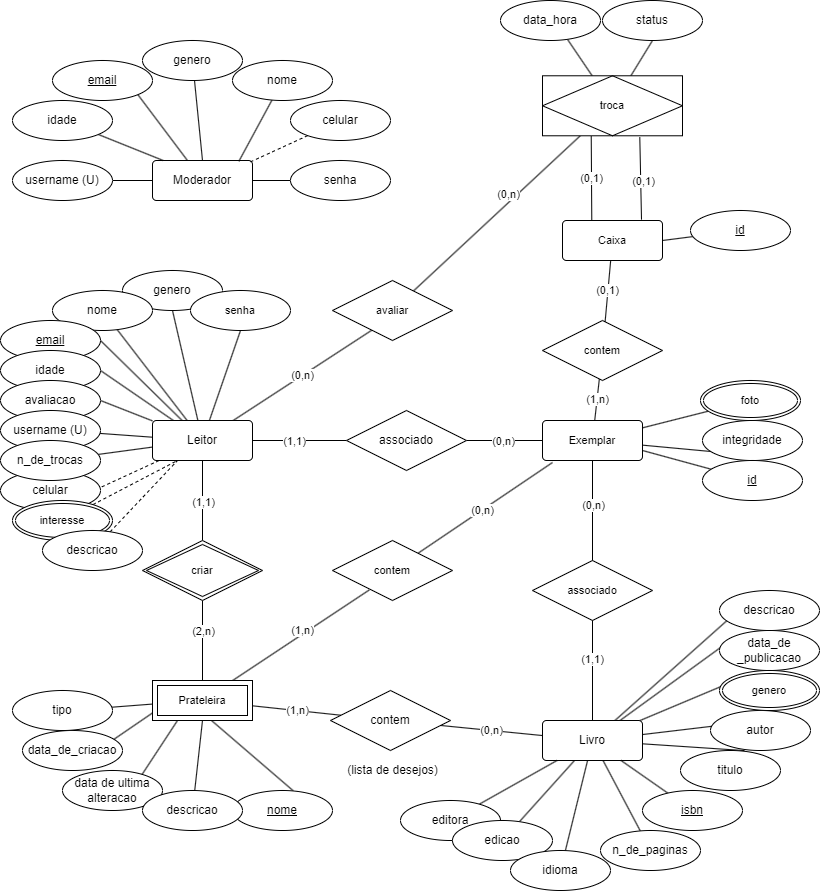
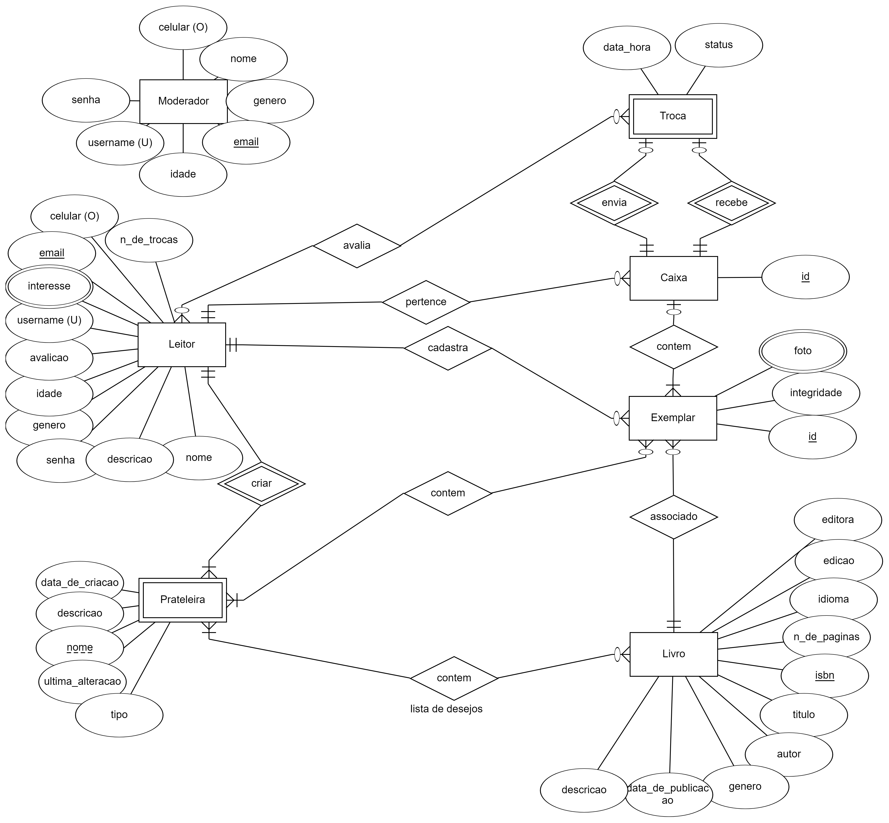
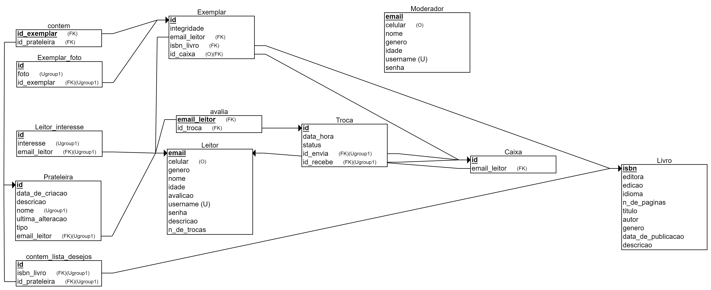

# Diagramas

## Comércio Eletrônico

### Histórico da Revisão 

|  Data  | Versão | Descrição | Autor |
|:-------|:-------|:----------|:------|
| 01/06/2021 | **1.00** | Versão Inicial | George Azevedo |
| 27/06/2021 | **2.00** | Adição do diagrama relacional | Gabriel FERREIRA |

## 1. Diagrama de casos de uso 

## 2. Diagrama de entidades e relacionamentos

## 3. Diagrama intermediário de entidades e relacionamentos

## 4. Diagrama relacional de entidades e relacionamentos

